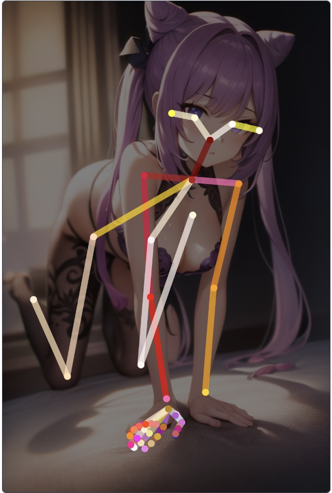

## Openpose hand Editor

this is a repository copied from [openpose-editor](https://github.com/fkunn1326/openpose-editor) used as a plugin of [stable-diffusion-webui](https://github.com/AUTOMATIC1111/stable-diffusion-webui)

now you can detect and edit hands

### Install

1. Open "Extensions" tab.
2. Open "Install from URL" tab in the tab.
3. Enter URL of this repo to "URL for extension's git repository".
4. Press "Install" button.
5. Reload/Restart Web UI.
